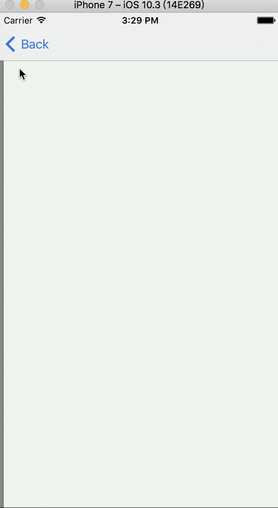
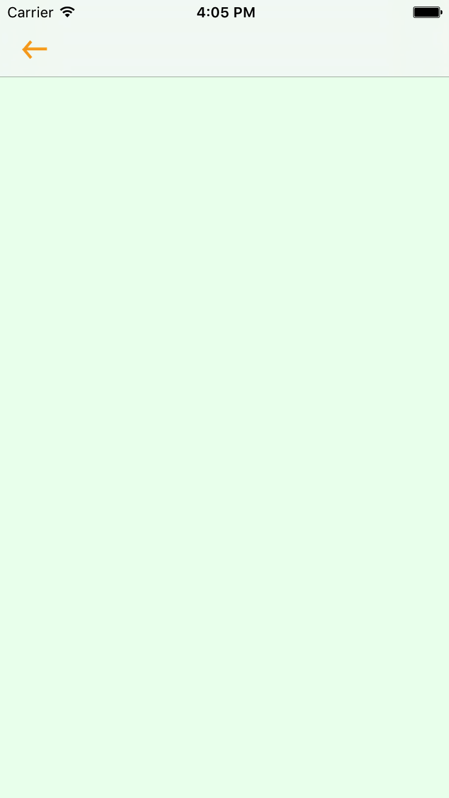
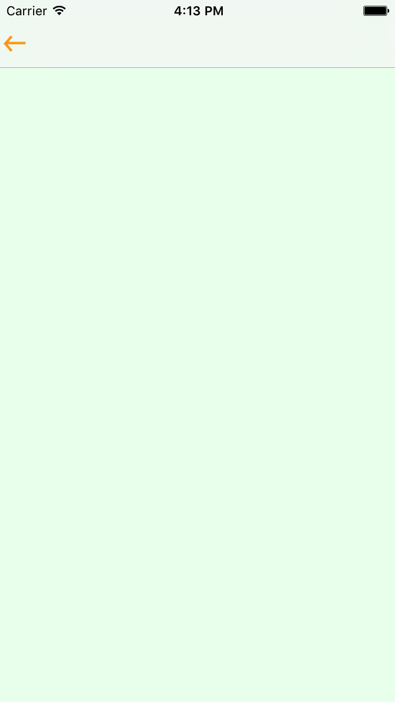
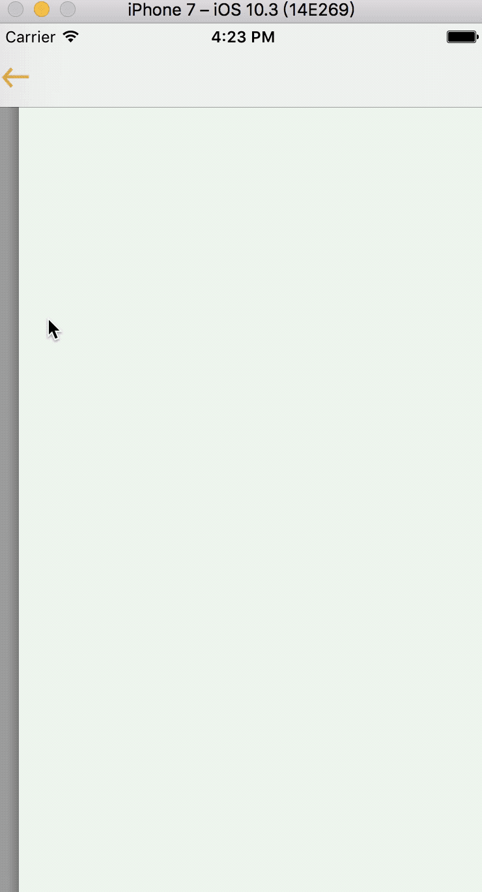
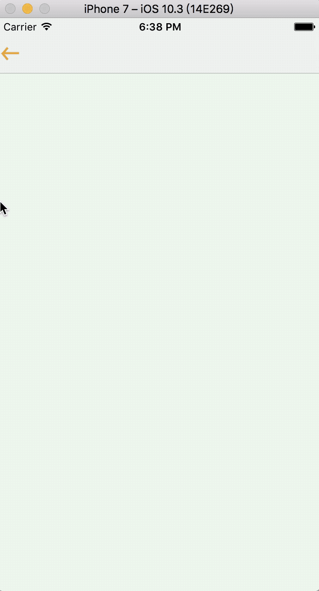

# navigationBar

## 目录
1. 默认 navigationBar
2. 替换返回按钮
3. 替换返回效果

### 1. 默认 navigationBar
> 新建项目-> editor -> embed in -> Navigation Controller
> 添加一个 viewController  ，设置不同的颜色。

默认效果：



git 导出命令：

```dash
git archive --format=zip --output=v1.0.zip 1.0
```

### 2. 替换返回按钮

#### 2.1 替换返回按钮

```swift
import UIKit

class OtherViewController: UIViewController {

    override func viewDidLoad() {
        super.viewDidLoad()

        let leftBtn = UIButton.init(type: UIButtonType.system)
        leftBtn.frame = CGRect(x:0 ,y:0, width:0, height:0)
        leftBtn.setBackgroundImage(UIImage.init(named: "nav_back"), for: UIControlState.normal)
        leftBtn.addTarget(self, action: #selector(leftBtnAction(btn:)), for: UIControlEvents.touchUpInside)
        self.navigationItem.leftBarButtonItem = UIBarButtonItem.init(customView: leftBtn)
    }
    
    func leftBtnAction(btn: UIButton) {
        self.navigationController?.popViewController(animated: true)
    }
    
}
```

效果：



#### 2.2 调整左侧间距

```swift
import UIKit

class OtherViewController: UIViewController {

    override func viewDidLoad() {
        super.viewDidLoad()

        let leftBtn = UIButton.init(type: UIButtonType.system)
        leftBtn.frame = CGRect(x:0 ,y:0, width:25, height:25)
        leftBtn.setBackgroundImage(UIImage.init(named: "nav_back"), for: UIControlState.normal)
        leftBtn.addTarget(self, action: #selector(leftBtnAction(btn:)), for: UIControlEvents.touchUpInside)
        let spaceItem = UIBarButtonItem.init(barButtonSystemItem: UIBarButtonSystemItem.fixedSpace, target: nil, action: nil)
        spaceItem.width = -15
        let leftBarButtonItem = UIBarButtonItem.init(customView: leftBtn)
        self.navigationItem.leftBarButtonItems = [spaceItem,leftBarButtonItem]
    }
    
    func leftBtnAction(btn: UIButton) {
        self.navigationController?.popViewController(animated: true)
    }
    
}
```

效果：


#### 2.3 右滑失效解决
> 细心的小伙伴会发现，向右滑动不能返回了。

```swift
// 遵守协议
class OtherViewController: UIViewController,UIGestureRecognizerDelegate {
```

```swift
// 设置代理
        self.navigationController?.interactivePopGestureRecognizer?.delegate = self;
        
```

效果： 小伙伴又可以尽情的玩耍了



git 导出命令：

```dash
git archive --format=zip --output=v2.0.zip 2.0
```

### 3. 替换滑动返回效果
> 实现思路
1. 禁用系统返回效果
2. 添加 滑动手势
3. push 的同时保存截屏
4. 滑动手势，开始滑动时添加一个imageView（显示截屏）,一个遮罩view（实现模糊效果）
5. 滑动时
    5.1 当前控制器view 的 transform 跟随手势偏移量改变
    5.2 imageView 的 transform 跟随手势偏移量改变
    5.3 遮罩 view 的 alpha 跟随手势偏移量改变
>
6. 滑动结束
>
    6.1 当前 view transform 恢复默认
    6.2 移除 imageView 
    6.3 移除 遮罩 view
    6.4 pop 不带动画
    
代码实现：

```swift
    override func viewDidLoad() {
        super.viewDidLoad()
        // 禁用默认滑动返回
        self.interactivePopGestureRecognizer?.isEnabled = false
        //添加返回手势
        panGestureRec = UIScreenEdgePanGestureRecognizer.init(target: self, action: #selector(panGestureRec(panGestureRec:)))
        panGestureRec?.edges = UIRectEdge.left
        self.view .addGestureRecognizer(panGestureRec!)
        
        // 初始化
        imageView = UIImageView.init(frame: CGRect(x:0, y:0, width:screenW, height:screenH))
        coverView = UIView.init(frame: (imageView?.bounds)!)
        coverView?.backgroundColor = UIColor.black
        screenshotImgs = NSMutableArray()
    }
```

截屏保存

```swift
    func screenShot()  {
        let rootVC = self.view.window?.rootViewController
        
        let size = rootVC?.view.frame.size
        
        UIGraphicsBeginImageContextWithOptions(size!, true, 0.0)
        
        let rect = CGRect(x:0, y:0, width:screenW, height:screenH)
        
        rootVC?.view.drawHierarchy(in: rect, afterScreenUpdates: false)
        
        let snapshot = UIGraphicsGetImageFromCurrentImageContext()
        
        if (snapshot != nil) {
            screenshotImgs?.add(snapshot!)
        }
        UIGraphicsEndImageContext()
    }
```

push 时截屏

```objc
    override func pushViewController(_ viewController: UIViewController, animated: Bool) {
        if self.viewControllers.count != 0 {
            screenShot()
        }
        super.pushViewController(viewController, animated: animated)
    }
```

手势对应方法

```swift
    func panGestureRec(panGestureRec:UIScreenEdgePanGestureRecognizer)  {
        if self.viewControllers.count == 1 {
            return
        }
        switch panGestureRec.state {
        case UIGestureRecognizerState.began:
            dragBegin()
        case UIGestureRecognizerState.ended:
            dragEnd()
        default:
            dragging(pan: panGestureRec)
        }
    }
```

手势开始滑动

```swift
    func dragBegin()  {
        self.view.window?.insertSubview(imageView!, at: 0)
        self.view.window?.insertSubview(coverView!, aboveSubview: imageView!)
        imageView?.image = screenshotImgs!.lastObject as? UIImage
    }
    
```

手势正在滑动

```swift
        let offsetX = pan.translation(in: self.view).x
        if offsetX > 0 {
            self.view.transform = CGAffineTransform.init(translationX: offsetX, y: 0)
        }
        let currentTranslateScaleX = offsetX/screenW
        
            imageView?.transform = CGAffineTransform.init(translationX: (offsetX - screenW) * 0.6, y: 0)
        
        let alpha = CGFloat(kDefaultAlpha) - (CGFloat(currentTranslateScaleX)/CGFloat(kTargetTranslateScale) ) * CGFloat(kDefaultAlpha)
            coverView?.alpha = alpha
```

手势滑动结束

```swift
    func dragEnd()  {
        // 取出挪动的距离
        let translateX = self.view.transform.tx
        
        if translateX <= 40 {
            UIView.animate(withDuration: 0.3, animations: {
                self.view.transform = CGAffineTransform.identity
                self.imageView?.transform = CGAffineTransform.init(translationX: -self.screenW, y: 0)
                self.coverView?.alpha = CGFloat(self.kDefaultAlpha)
            }, completion: { (isFinished) in
                self.imageView?.removeFromSuperview()
                self.coverView?.removeFromSuperview()
            })
        }else {
            UIView.animate(withDuration: 0.3, animations: {
                self.view.transform = CGAffineTransform.init(translationX: self.screenW, y: 0)
                self.imageView?.transform = CGAffineTransform.init(translationX:0, y: 0)
                self.coverView?.alpha = 0
            }, completion: { (isFinished) in
                self.view.transform = CGAffineTransform.identity
                
                self.imageView?.removeFromSuperview()
                self.coverView?.removeFromSuperview()
                print(self.popViewController(animated: false) ?? "")
            })
        }
    }
```

效果：


git 导出命令：

```dash
git archive --format=zip --output=v3.0.zip 3.0
```
    

